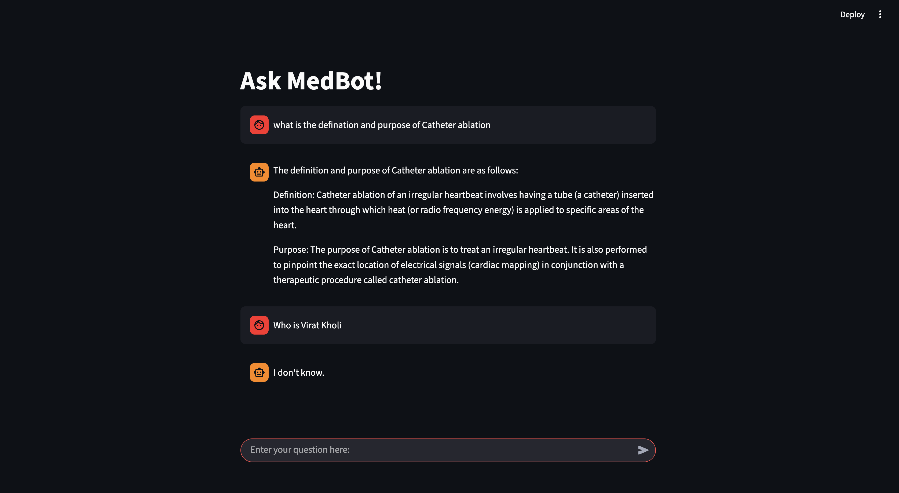

# 🩺 MedBot – PDF-Based Medical RAG Chatbot


An interactive **medical document question-answering web app** built using **Retrieval-Augmented Generation (RAG)**.  
Users can ask questions from medical PDF documents and receive **accurate, context-grounded answers**.

---

## 💡 About

This project demonstrates how to build a **production-ready RAG application** using modern LLM tooling.  
MedBot retrieves relevant information from uploaded PDFs and ensures **zero hallucination** by answering **only from document context**.

### Key Capabilities
- 📄 Medical PDF ingestion  
- ✂️ Smart text chunking  
- 🔎 Semantic search using FAISS  
- 🧠 Context-aware LLM responses  
- 💬 Chat-style Streamlit interface  

Ideal as a **portfolio-grade AI project** showcasing applied LLM engineering.

---

## 🛠️ Tech Stack

- **Language:** Python  
- **Frontend:** Streamlit  
- **LLM:** LLaMA-3.1-8B-Instant (Groq)  
- **Embeddings:** HuggingFace MiniLM  
- **Vector DB:** FAISS  
- **Framework:** LangChain  
- **Document Loader:** PyPDFLoader  

---

## 🚀 How It Works (RAG Pipeline)

1. **Load PDFs** from the `Data/` directory  
2. **Split text** into chunks (500 chars, overlap 50)  
3. **Generate embeddings** using MiniLM  
4. **Store vectors** locally in FAISS  
5. **Retrieve top-k chunks** per query  
6. **Generate answers** strictly from retrieved context  
---
## 🤖 Chat Interface


---

## ⚙️ Setup & Installation

This project uses **`uv`** for dependency and environment management.  
All dependencies are defined in `pyproject.toml`.


#### 1️⃣ Prerequisite: Install `uv`

If you don’t have `uv` installed:

```bash
pip install uv
```
#### 2️⃣ Clone the Repository
```bash
git clone https://github.com/Rishabh23-Codes/Medical-Chatbot.git
```

#### 3️⃣ Create Virtual Environment
```bash
uv venv
source .venv/bin/activate        # Mac/Linux
.venv\Scripts\activate           # Windows
```

#### 4️⃣ Install Dependencies
```bash
All dependencies are automatically installed from pyproject.toml:
uv sync
```

#### 5️⃣ Add Environment Variable
```bash
GROQ_API_KEY=your_groq_api_key
```
#### ▶ Run the Application
```bash
streamlit run main.py
```

## 🔮 Future Improvements

- 🧠 **Chat Memory Support**  
  Maintain conversation history to enable follow-up questions and context-aware interactions across multiple user queries.

- 🧩 **Multimodal RAG System**  
  Extend the pipeline to understand not only text but also **tables, charts, and images** from PDFs using multimodal embeddings and vision-capable LLMs.

- 📚 **Multiple PDF Handling**  
  Enable seamless querying across **multiple PDFs simultaneously**, with document-level filtering and source attribution.

- 📑 **Structured Data Extraction**  
  Improve table parsing and structured content understanding for more accurate medical insights.

